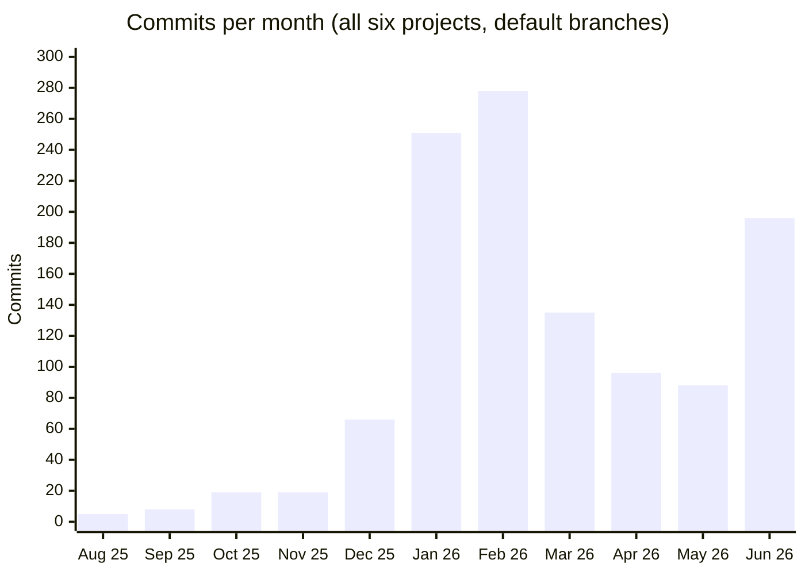

# Building with AI agents — a report with real numbers

I want to be transparent about this rather than coy: **AI wrote most of the code in these projects.** I think that's worth bragging about, not hiding — because the interesting part isn't that AI can produce code. It's that *shipping six real systems* with AI takes a skill set of its own: writing precise specs, making architecture decisions the agent can't make, reviewing relentlessly, and being stubbornly persistent when the agent runs into walls.

This document is the evidence.

---

## The before/after

I've been on GitHub since 2013. Same person, same job situation, same hours in the day.

| Year | GitHub contributions |
|---|---|
| 2025 (entire year) | **100** |
| 2026 (January – June) | **1,532** |

That's a **~15× acceleration** in commit-level activity, and — more importantly — a step change in what actually got finished: in twelve months, six projects went from empty repos to systems with real architecture, real tests, and in one case a live deployment and 16 published NuGet packages.

## Monthly commit volume across the six portfolio projects

The inflection point (December 2025 → January 2026) is exactly when agentic coding tools became my primary workflow instead of an occasional assistant.

## Per-project scorecard

| Project | Commits | Code LOC | Docs (MD) LOC | Tests | Active period |
|---|---:|---:|---:|---:|---|
| CareOps AU | 869 | 334,469 | 34,239 | ~700 | Jan – Jun 2026 |
| Help or Yelp | 162 | 38,976 | 4,913 | 163 | Jul 2025 – Jun 2026 |
| Syed.Messaging | 92 | 10,215 | 3,075 | 120 | Dec 2025 – Jun 2026 |
| Rufio | 16 | 43,244 | 6,079 | 225 | Apr – Jun 2026 |
| ShomoySuchi | 15 | 31,679 | 2,144 | — | Feb – Jun 2026 |
| Personal Co-Worker | 7 | 1,240 | 451 | — | Jun 2026 – |
| **Total** | **~1,161** | **~460,000** | **~50,900** | **~1,190** | |

Worth noticing: Rufio has 43K lines in only 16 commits — that's the agentic signature. A "commit" in this workflow is often a complete, reviewed, tested feature, not a keystroke checkpoint.

**Methodology.** Commit counts are from each repo's default branch (`git log`); LOC counts tracked source files (`.cs`, `.ts/.tsx`, `.js/.jsx`, `.sql`, `.css`, config) excluding lockfiles, generated files, and `node_modules`; test counts are xUnit `[Fact]`/`[Theory]` attributes plus Vitest cases; contribution totals are from the GitHub GraphQL API (includes private repos). Raw line counts are inflated by AI — I know. The point is not the line count; it's the six working systems.

---

## The toolchain

| Tool | Role in my workflow |
|---|---|
| **Claude Code** | Primary agent — full features end to end: implementation, tests, refactoring, even this portfolio |
| **Cursor** | AI-native IDE work — in-editor edits, quick iterations |
| **Antigravity** | Agentic IDE for parallel/background task runs |
| **ChatGPT** | Rubber duck — product thinking, architecture trade-offs, "is this a bad idea?" conversations |

## What the AI does — and what it doesn't

**The agents do:** the bulk of implementation, test scaffolding, migrations, boilerplate, documentation drafts, refactors across large surfaces.

**I do:**

- **Product decisions.** What to build, what to cut, who it's for. Every project starts with a written product design and backlog *before* the first prompt.
- **Architecture.** Multi-tenancy strategy, CQRS boundaries, outbox vs. dual-write, transport abstraction design — the agent executes these decisions; it doesn't make them.
- **Specification.** The single highest-leverage skill. Vague prompt → plausible garbage. Precise spec with constraints and acceptance criteria → shippable code. Each repo carries a `claude.md` working contract the agent must follow.
- **Review.** Every diff gets read. The agent is a brilliant, fast, occasionally overconfident junior — the review gate is where quality actually happens.
- **Persistence.** This is the underrated one. Agents fail: they go down wrong paths, produce subtle bugs, hit context limits mid-refactor. The difference between a toy demo and 869 commits of working multi-tenant SaaS is refusing to accept a broken state — re-specifying, re-running, bisecting, and grinding until it's actually right.

## What I learned

1. **Docs are the interface.** 50K lines of Markdown across these repos isn't bureaucracy — it's what makes agents (and future me) effective. The spec *is* the program now.
2. **Tests are the safety rail that makes speed possible.** ~1,190 tests are why I can let an agent refactor a 334K-line codebase without fear.
3. **Small products stay small; platforms are earned.** The "build the slice, not the platform" rule in Personal Co-Worker exists because AI makes it dangerously easy to build everything at once.
4. **The bottleneck moved.** It's no longer typing speed or API knowledge — it's decision quality, review bandwidth, and knowing what "done" looks like. Those are engineering judgment, and they don't come from the model.

---

Every number in this document is reproducible from git history, the GitHub API, and nuget.org. Ask me and I'll show the queries.
