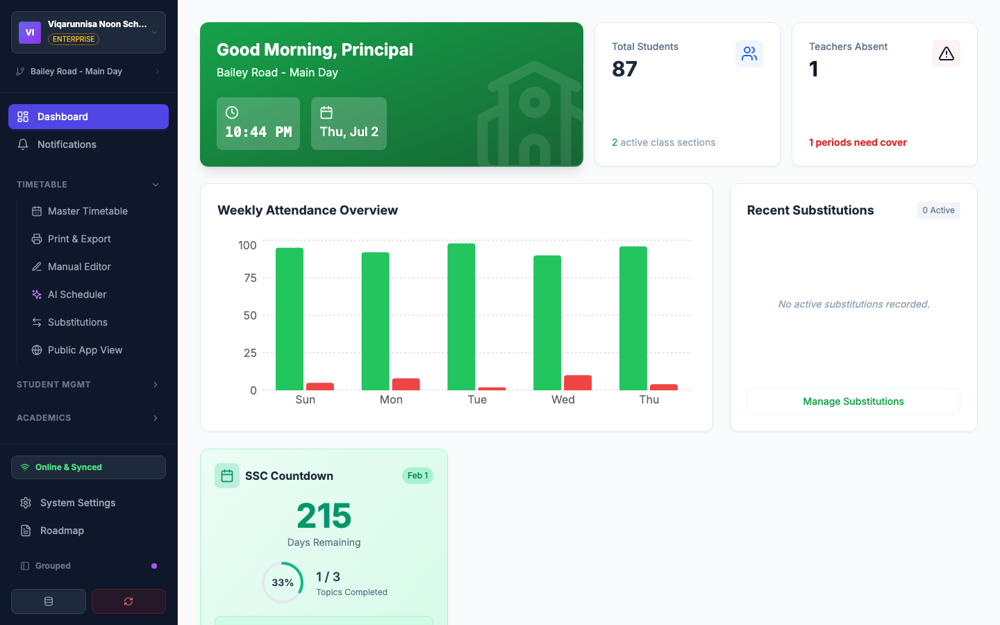

# Syed Moshiur Murshed — Engineering Portfolio

**Engineering Leader | Software Architect | Senior .NET Engineer | AI-Assisted Software Engineering**

**15+ years building enterprise software, leading engineering teams, and exploring how AI transforms modern software development.**

📫 [moshiur.m@gmail.com](mailto:moshiur.m@gmail.com) · [LinkedIn](https://www.linkedin.com/in/smurshed/) · [GitHub @moshiur](https://github.com/moshiur)

---

I build production-grade SaaS platforms end to end — backend, web, mobile, infrastructure, and CI — using AI as a force multiplier throughout the software development lifecycle. Over the last 12 months that workflow produced **6 substantial projects, ~1,160 commits, ~460,000 lines of code, and ~1,190 automated tests** — in my own time.

Most of these projects live in private repositories (they are real products with real ambitions), so this portfolio exists to show what's inside them. If you'd like a code walkthrough of any private repo, I'm happy to give one — just ask.

## Engineering Leadership

- Led international engineering teams across Austria and India
- Former Head of Software Development
- Hiring, mentoring and coaching engineers
- Driving architecture, delivery and engineering quality
- Building collaborative, high-trust engineering cultures

## Current Focus

- AI-first engineering and AI-assisted software development
- Multi-agent systems
- Distributed architectures
- Building production-grade SaaS products

> 🤖 **The AI story:** I use AI agents (Claude Code, Cursor, Antigravity, ChatGPT) as a standard part of my engineering practice. My GitHub contributions went from **100 in all of 2025 to 1,532 in the first half of 2026**. How that works in practice — and what the AI does *not* do — is documented with real numbers in [**AI-COLLABORATION.md**](AI-COLLABORATION.md).

---

## 🌐 Live demo

**[ShomoySuchi](https://shomoysuchi-web.onrender.com/)** — school management & AI timetable scheduling platform, live right now.
*(Free-tier hosting: the first load may take ~30 seconds while the instance wakes up.)*

---

## Featured projects

| Project | What it is | Stack | Scale |
|---|---|---|---|
| [**CareOps AU**](projects/careops.md) | Multi-tenant care-operations SaaS for NDIS / aged-care providers (EVV, rostering, timesheets) | .NET 10, PostgreSQL, Redis, React Native, React, Auth0, Bicep | 869 commits · 334K LOC · ~700 tests |
| [**Rufio**](projects/rufio.md) | Service marketplace with direct assignment, AI matching, and broadcast bidding | .NET 10 (CQRS/MediatR), React 19, Tailwind | 43K LOC · 225 tests |
| [**Help or Yelp**](projects/help-or-yelp.md) | Community platform connecting people who need help with those offering it | .NET 10 microservices, YARP, Next.js 14, RabbitMQ (via Syed.Messaging), Aspire | 162 commits · 39K LOC · 163 tests |
| [**Syed.Messaging**](projects/syed-messaging.md) | **Public, MIT** — open-source library that gives .NET services reliable message-based communication (queues, retries, outbox) over RabbitMQ, Kafka, or Azure Service Bus without broker-specific code | .NET 10, OpenTelemetry, KEDA | **16 NuGet packages · 4,700+ downloads** · 120 tests |
| [**ShomoySuchi**](projects/shomoysuchi.md) | "Untis for Bangladesh" — school management + AI timetable solver · **[live](https://shomoysuchi-web.onrender.com/)** | React 18, .NET 10, PostgreSQL, genetic algorithm + Gemini | 32K LOC |
| [**Personal Co-Worker**](projects/personal-coworker.md) | Self-hosted, model-agnostic AI agent with a four-tier memory subsystem | .NET, Microsoft Agent Framework, pgvector, OpenTelemetry | Early stage, in active development |

Also public: [Syed.Messaging](https://github.com/moshiur/Syed.Messaging) · [OnCallo](https://github.com/moshiur/OnCallo) — and more on [github.com/moshiur](https://github.com/moshiur).

---

## By the numbers (July 2025 – July 2026)

| | |
|---|---|
| GitHub contributions, H1 2026 | **1,532** (vs 100 in all of 2025 — 15×) |
| Commits across the six projects above | **~1,160** |
| Lines of code (excl. docs, lockfiles, generated) | **~460,000** |
| Automated tests (xUnit + Vitest) | **~1,190** |
| Published NuGet packages | **16** (4,700+ downloads) |
| Production deployments | ShomoySuchi (Render), CI/CD on CareOps & Syed.Messaging (GitHub Actions) |

All numbers are measured from git history and public registries — the methodology is in [AI-COLLABORATION.md](AI-COLLABORATION.md).

---

## How I work

- **Product first.** Every project starts with a written product design, backlog, and architecture doc — CareOps alone carries 34K lines of Markdown documentation next to the code.
- **Spec-driven AI collaboration.** I write the specs, make the architecture calls, and review everything; AI agents do the heavy lifting on implementation. Details in [AI-COLLABORATION.md](AI-COLLABORATION.md).
- **Production patterns by default.** Multi-tenancy, outbox/inbox, sagas, OpenTelemetry, health checks, DLQ-driven autoscaling — these show up in my side projects because that's how real systems survive.
- **Tests are not optional.** ~1,190 automated tests across the portfolio; CareOps runs CI on every push.

---

This portfolio repo was itself assembled with Claude Code — screenshots curated from project docs, statistics mined from git history. Practicing what I preach.
