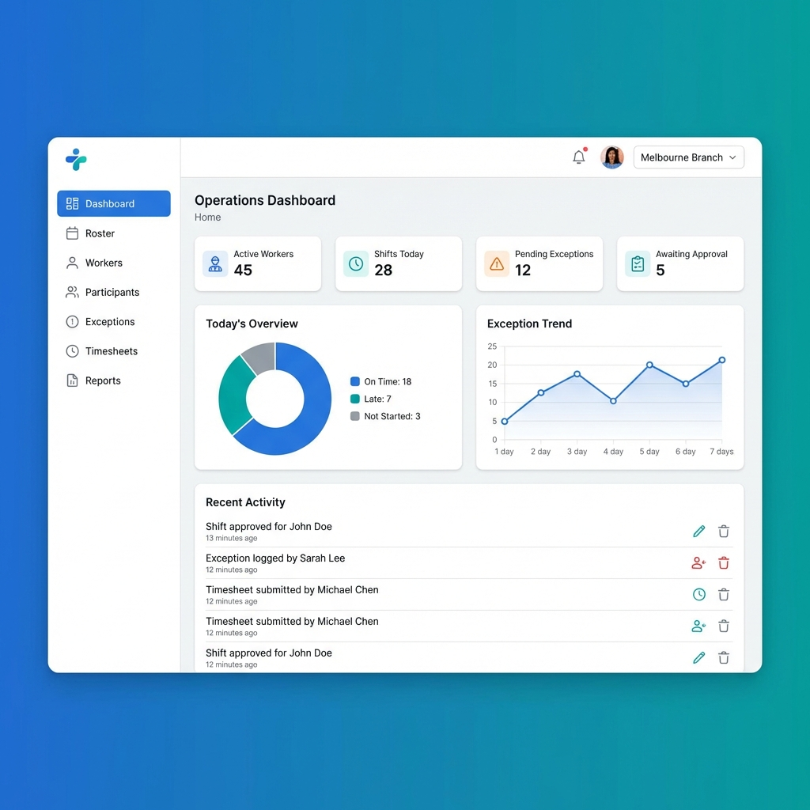
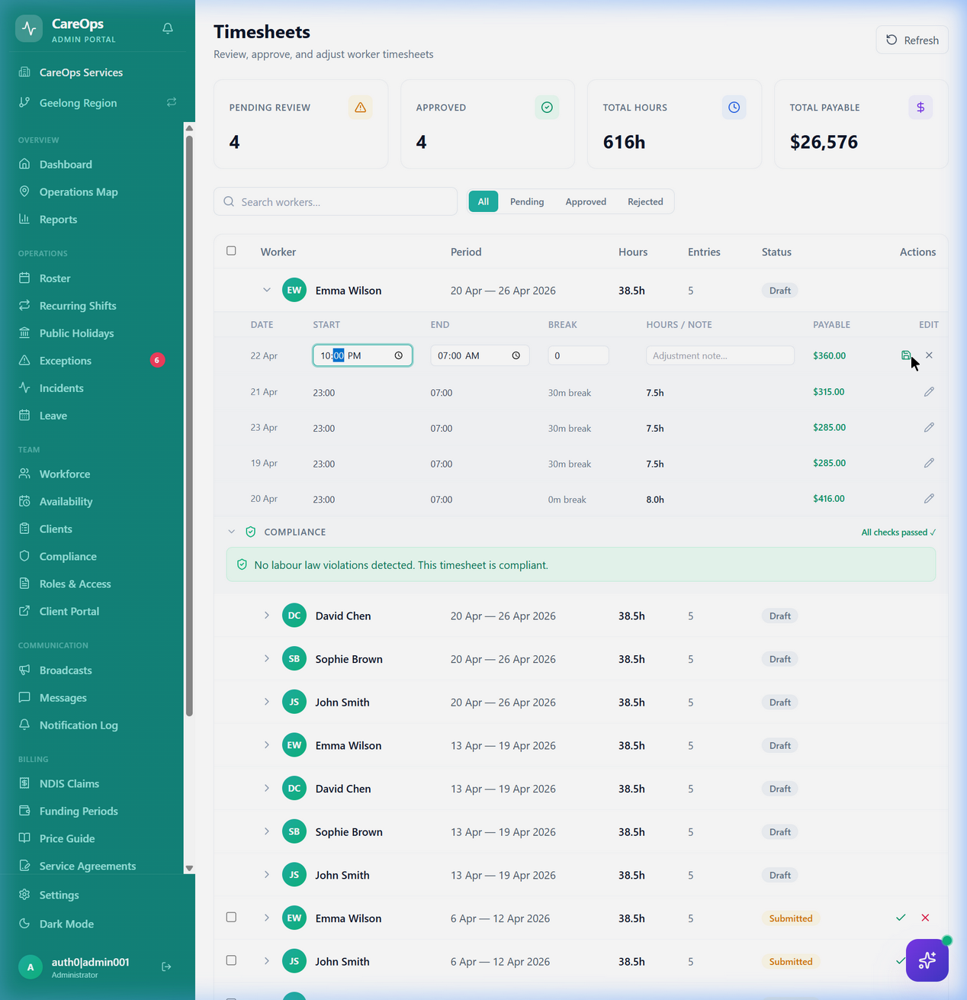
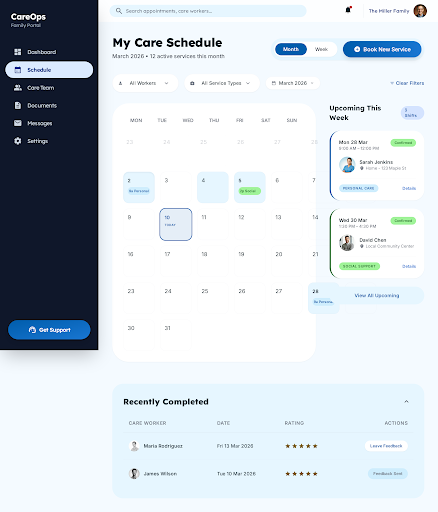
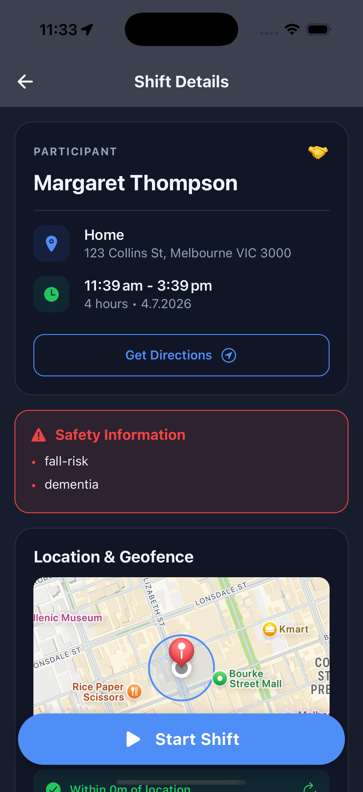
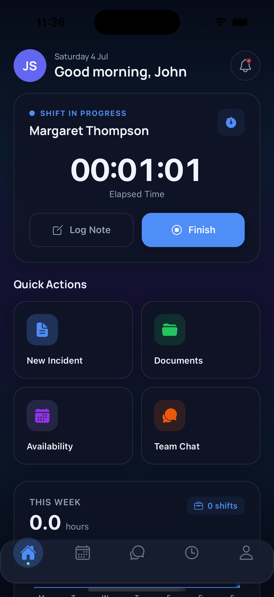
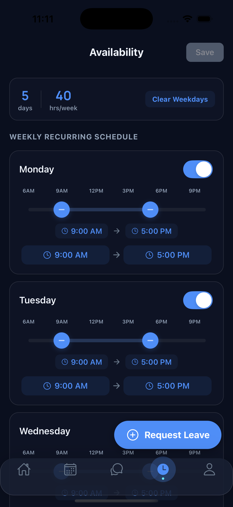

# CareOps AU

**Multi-tenant care-operations SaaS for Australian NDIS and aged-care providers** — the largest project in this portfolio and my flagship: **869 commits, ~334K lines of code, ~700 automated tests, and 34K lines of documentation** built January–June 2026.

> Private repository — code walkthrough available on request.

## What it does

Australian care providers must prove that a support worker was physically present at a client visit (electronic visit verification, EVV), roster those workers across shifts, and turn verified attendance into payroll-ready timesheets. CareOps covers that pilot loop end to end:

- 📍 **Geofenced clock-in/out** — EVV-compliant attendance with GPS accuracy checks
- 📅 **Rostering & scheduling** — drag-and-drop shift management with worker assignment
- ⚠️ **Exception handling** — policy violations surfaced for human review and resolution
- 📊 **Timesheets** — automated calculation and payroll export
- 🏢 **Multi-tenancy** — one deployment, many providers, strict data isolation
- 👪 **Family portal** — clients and families see schedules, the care team, and visit history
- 💰 **NDIS billing** — claims generation, price-guide import, funding periods

## Architecture

| Layer | Technology |
|---|---|
| Backend | .NET 10, ASP.NET Core, EF Core — clean architecture (Domain / Application / Infrastructure / Api) |
| Database | PostgreSQL 16 · Redis 7 cache |
| Worker mobile app | React Native (Expo) |
| Admin web | React 18, TypeScript, Vite |
| Auth | Auth0 (OIDC) |
| Cloud | Azure Container Apps, infrastructure as code in Bicep |
| CI/CD | GitHub Actions on every push |

The repo carries **36 Architecture Decision Records** plus product specs, compliance docs (GDPR/privacy), ops runbooks, and a maintained backlog — documentation is treated as part of the product.

## Screenshots

**Admin portal — operations dashboard** (live shift timeline, action center, payroll status, live operations map):

**Admin portal — timesheets** with inline entry editing and automated labour-law compliance checks:

**Family portal** — clients and their families see the care schedule, care team, and completed visits:

**Mobile worker app (React Native / Expo)** — the EVV core loop, captured live from the iOS Simulator: geofenced check-in (GPS verified "within 0m of location", client safety flags shown before the visit), the running shift timer, and the weekly availability editor:

  
  
  

## Why it's interesting engineering-wise

- Real multi-tenant isolation decisions (per-tenant data partitioning, tenant-scoped auth claims) rather than a single-tenant demo
- EVV is a compliance feature: the geofence, timestamps, and exception trail have to be defensible, not just functional
- Four user surfaces — worker mobile app, admin web, family portal, and API consumers — against one domain model
- 108 test files / ~700 test cases keep a 334K-line codebase refactorable

[← Back to portfolio](../README.md)
