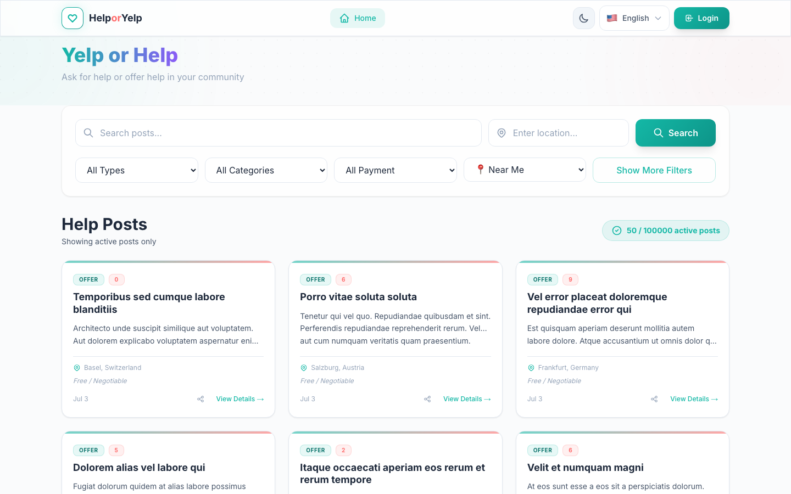
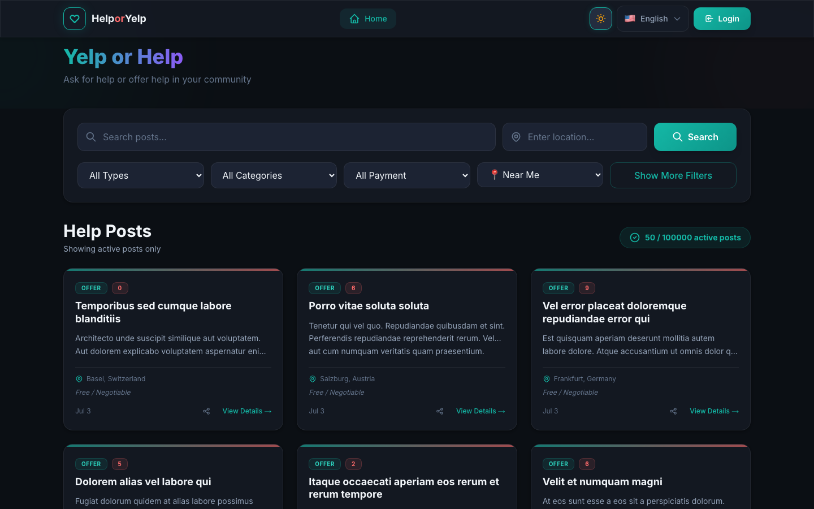

# Help or Yelp

**A community-driven platform connecting people who need help with those willing to offer it** — the longest-running project in this portfolio: **162 commits from July 2025 to June 2026, ~39K lines of code, 163 automated tests**.

> Private repository — code walkthrough available on request.

## What it does

Users post requests for help (or offers of help) with location and expiry; others respond, coordinate, and rate the experience. Think of it as a neighborhood mutual-aid board with real accounts, moderation, and messaging.

## Screenshots

The post feed — search, filters, location-aware community posts (light and dark theme):

*(Captured from a locally running instance seeded with 100,000 generated posts — the repo ships its own `PostSeeder` load-testing tool.)*

## Architecture

The project started as a .NET monolith and has been re-architected into event-driven microservices:

| Layer | Technology |
|---|---|
| Services | .NET 10 — **Identity**, **Posts**, **Messages** microservices, database-per-service |
| API edge | YARP gateway |
| Messaging | RabbitMQ — via my own [**Syed.Messaging**](syed-messaging.md) library (dogfooding: outbox, retry, SignalR bridge) |
| Orchestration | .NET Aspire AppHost — Postgres, RabbitMQ, pgAdmin, and all services in one `dotnet run` |
| Frontend | Next.js 14, TypeScript — i18n (English/German), dark mode, SignalR live messaging |
| Database | PostgreSQL (one per service), EF Core migrations |

## Why it's interesting engineering-wise

- This is the project where my workflow *changed*: it started in mid-2025 as conventional solo development and crossed into agentic development in early 2026 — its commit history is the before/after picture in one repo
- It's also where I **dogfood Syed.Messaging**: the services communicate through my own published NuGet packages, which is how library API pain gets discovered
- Monolith → microservices as a deliberate learning arc: the same product, re-platformed with database-per-service, an outbox, and a gateway
- Bilingual UI (English/German) with locale middleware — built for a real Austrian/German audience

[← Back to portfolio](../README.md)
