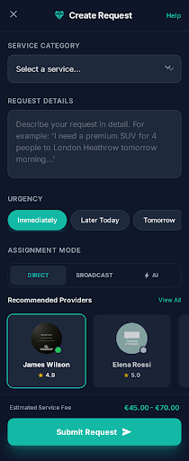
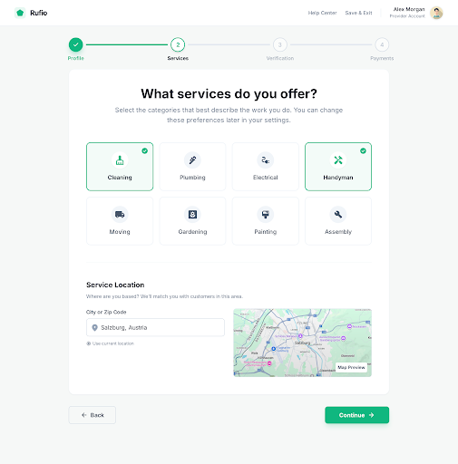
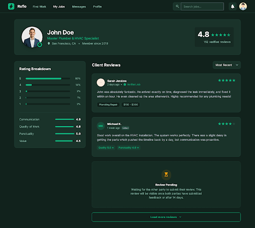
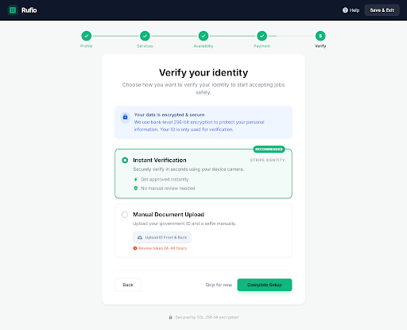
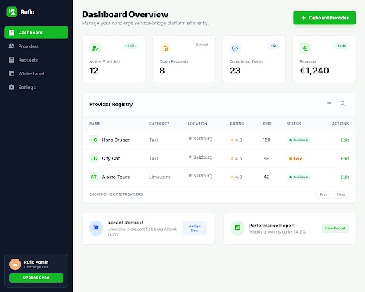

# Rufio

**A service marketplace connecting clients with vetted providers** through three assignment modes: direct assignment, AI-based matching, or broadcast bidding.

> Private repository — code walkthrough available on request. **43K lines of code · 225 automated tests**, built April–June 2026.

## What it does

A client posts a service request ("I need a premium SUV for 4 people to the airport tomorrow morning"); Rufio either sends it straight to a chosen provider, lets an AI matcher pick the best fit, or broadcasts it for competitive bids. The platform handles provider onboarding and verification, escrowed payments, disputes, and a review system.

## Architecture

| Layer | Technology |
|---|---|
| Backend | .NET 10, PostgreSQL, MediatR (CQRS) |
| Frontend | React 19, TypeScript, Tailwind CSS (Vite), PWA |
| Docs | Full product design covering monetization, payments, onboarding, disputes, ratings |

## Screenshots

Client request creation (design mockup) and the real provider-onboarding wizard:

  

Two-sided review system with rating breakdown and double-blind "review pending" state:

Provider identity verification (real app):

Admin dashboard (design mockup):

## Why it's interesting engineering-wise

- CQRS via MediatR with a clear command/query split — the request lifecycle (draft → assigned/bid → in progress → reviewed → paid) is a genuine state machine
- Three assignment strategies behind one interface (direct / AI match / broadcast bidding)
- 225 tests over 16 commits — each commit is a complete, reviewed feature (see [AI-COLLABORATION.md](../AI-COLLABORATION.md) on why that ratio looks the way it does)

[← Back to portfolio](../README.md)
