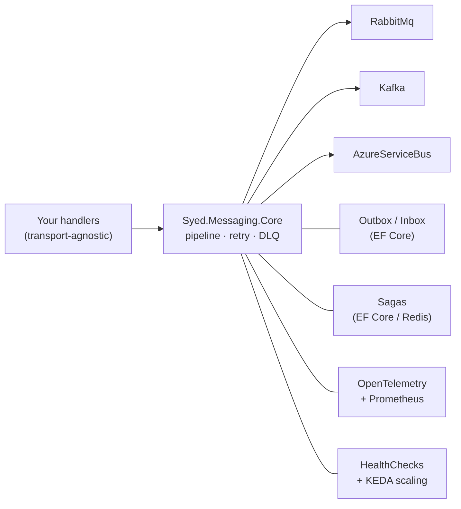

# Syed.Messaging

**Public, MIT-licensed, transport-agnostic .NET messaging framework** — one API across RabbitMQ, Kafka, and Azure Service Bus, with the operational stack built in rather than bolted on.

🔗 **[github.com/moshiur/Syed.Messaging](https://github.com/moshiur/Syed.Messaging)** — this one you can read right now.
📦 **16 packages on [NuGet](https://www.nuget.org/packages?q=Syed.Messaging), 4,700+ combined downloads**, currently at v1.3.0.

## What problem it solves

In a distributed system, services don't call each other directly for everything — they publish events and commands through a message broker (RabbitMQ, Kafka, Azure Service Bus), so work survives crashes, spikes get buffered in queues, and services stay decoupled. But talking to a broker *correctly* means writing a lot of plumbing yourself: serialization, retries with backoff, dead-letter queues for messages that keep failing, an outbox so a database write and its event are published atomically, deduplication on the consumer side, distributed tracing so you can follow a message across services.

Every team ends up rebuilding that plumbing — or adopting a framework like MassTransit or NServiceBus that provides it. **Syed.Messaging is that framework**, MIT-licensed: you write plain message handlers, and the library handles the broker plumbing and reliability patterns for you.

```csharp
// You write a handler...
public class OrderPlacedHandler : IMessageHandler<OrderPlaced>
{
    public Task HandleAsync(OrderPlaced msg, MessageContext ctx) => ...;
}

// ...and register everything in one fluent chain. Swapping RabbitMQ for
// Kafka or Azure Service Bus is a config change — handlers don't change.
services.AddMessaging(b => b.UseRabbitMq(...).AddHandlersFromAssembly(...));
```

What you get out of the box:

- 🔌 **One API, three transports** — RabbitMQ, Kafka, Azure Service Bus; swap without touching handler code
- 🧰 **Reliability patterns included** — outbox, inbox (dedup), sagas (long-running workflows), retry + dead-letter queues, middleware pipeline, RPC, health checks
- 📊 **Observability-first** — OpenTelemetry traces, 7 counters + 1 histogram, a DLQ dashboard, and a KEDA autoscaling playbook ship with the library
- 📖 **Migration guide from MassTransit** — timely, since MassTransit v9 went commercial; consumer registration, sagas, outbox, retry, and middleware compared side by side

## The package family

`Abstractions` · `Core` · `RabbitMq` · `Kafka` · `AzureServiceBus` · `Outbox.EfCore` · `Inbox.EfCore` · `Sagas` · `Sagas.EfCore` · `Sagas.Redis` · `OpenTelemetry` · `HealthChecks` · `SignalR` · `Aspire` · `Chaos` · `BuildingBlocks`

## Architecture at a glance



**Dogfooded in production-style use:** the [Help or Yelp](help-or-yelp.md) microservices communicate exclusively through these packages — outbox, retry, and the SignalR bridge included. Library pain points get found by the library author.

## Why it's interesting engineering-wise

- Designing a **transport abstraction that doesn't leak** is the hard part — delivery semantics, partitioning, and dead-lettering differ meaningfully across the three brokers
- The timing matters: built as MassTransit announced its move to commercial licensing — an MIT-licensed alternative with the operational patterns teams actually rely on
- 120 automated tests, CI/CD publishing pipeline via GitHub Actions, versioned docs, a chaos-testing package (`Syed.Messaging.Chaos`) for failure injection
- Real-world operability: DLQ-driven autoscaling means consumers scale on *backlog pain*, not just CPU

[← Back to portfolio](../README.md)
